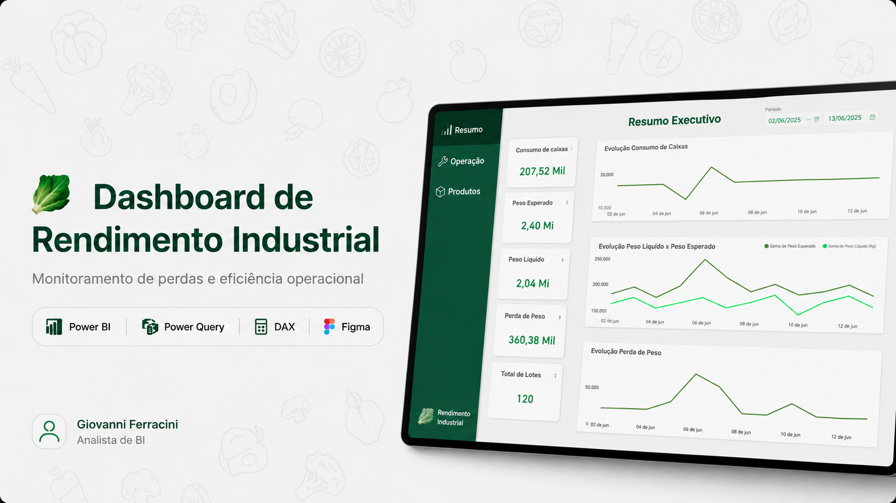
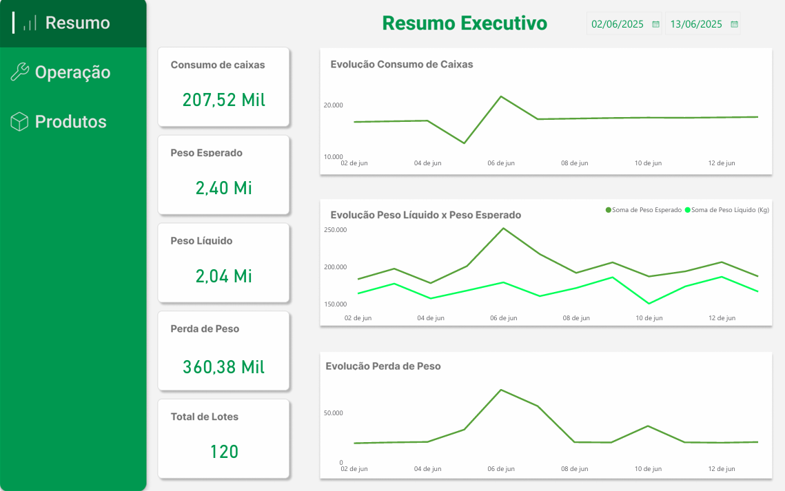
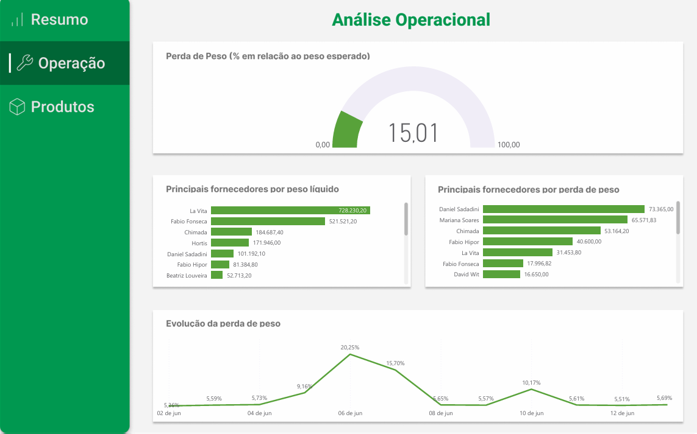
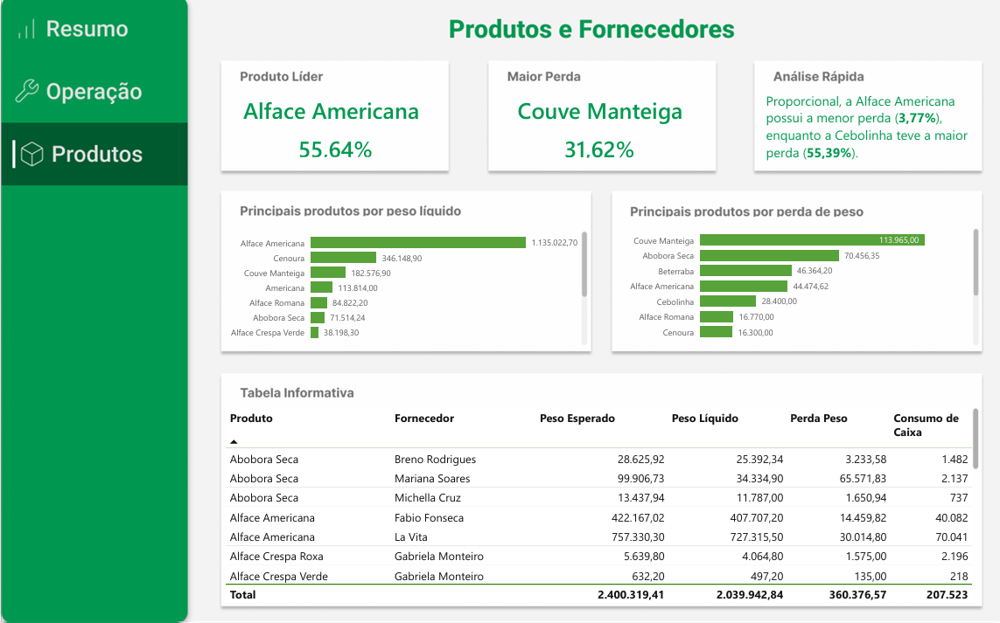

# 🥬 Dashboard de Rendimento Industrial — Power BI
_Power BI • DAX • Power Query • Figma_

Dashboard desenvolvido para monitorar eficiência operacional, perdas produtivas e desempenho de fornecedores e produtos em uma indústria de processamento de hortifrutti.

Todos os dados utilizados são **fictícios** e destinados exclusivamente a fins de estudo, aprendizagem e composição de portfólio.

---

## 🧠 Principais Habilidades

* Power Query para processos de ETL
* Linguagem DAX para desenvolvimento de métricas e indicadores
* Design UX/UI focado na experiência do usuário
* Storytelling com dados
* Pensamento analítico aplicado ao negócio

---

## 📊 Estrutura do Projeto

### 📈 Resumo Executivo

Visão geral dos principais indicadores e evolução temporal do consumo de caixas, peso esperado e peso líquido.

### ⚙️ Análise Operacional

Monitoramento do percentual de perda e identificação das principais oportunidades de melhoria da operação.

### 📦 Produtos e Fornecedores

Análise detalhada dos produtos e fornecedores, permitindo identificar concentração produtiva e comportamento das perdas.

---

## 💡 Principais Insights

* 🥇 Alface Americana representa 55,64% do peso líquido total.
* ⚠️ Couve Manteiga concentra 31,62% das perdas totais.
* 📉 Cebolinha apresentou a maior perda proporcional.
* 📦 A perda média operacional registrada foi de 15,01%.

---

## 🛠️ Ferramentas Utilizadas

* Microsoft Power BI
* Power Query
* Linguagem DAX
* Microsoft Excel
* Figma (UX/UI e apresentação do case)

---

## 🗃️ Arquivos

* Dashboard Rendimento Industrial (.pbix)
* Dataset (.xlsx)
* README.md
* Apresentação do projeto
* Imagens do dashboard

---

## 🚀 Como Utilizar

1. Clone este repositório;
2. Abra o arquivo `.pbix` utilizando o Power BI Desktop;
3. Importe a base de dados disponibilizada;
4. Atualize as consultas e explore o dashboard.

---

## 📬 Contato

* E-mail: [gioferracini97@gmail.com](mailto:gioferracini97@gmail.com)
* LinkedIn: [linkedin.com/in/giovanniferracinidata/](https://www.linkedin.com/in/giovanniferracinidata/)

---

⭐ Este projeto representa não apenas uma solução em Power BI, mas também a evolução da forma como enxergo a construção de dashboards: menos foco em gráficos e mais foco em comunicação, contexto e tomada de decisão.
